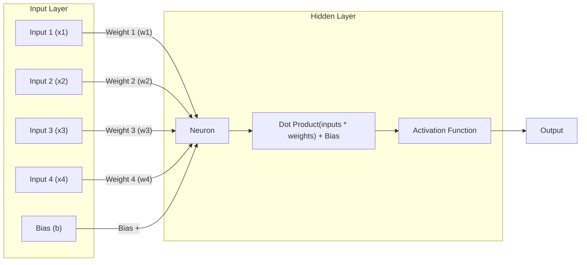

# Neural Network From Scratch

---

### Table of Contents


- [Cross Entropy Loss](./notebooks/LossFunctions.ipynb#cross-entropy-loss-function)
- Activation Functions:
  - [Softmax](./notebooks/Activations.ipynb)

---
### A neural network is a collection of neurons that are connected in layers.
- A neural network has an `input layer`, `hidden layers`, and an `output layer`.
- Each neuron in a neural network is a called a `node`, but by convention, 
we refer to nodes as `units`. A `unit` is a `node (neuron)` in a neural network that 
takes an input, calculates the weighted sum of the inputs from predecessor 
nodes and then applies a nonlinear function to produce its output.
- The input layer is the first layer of the neural network.
    - The input layer has neurons that take the input to the neural network.
    - **Note**: The input to the neural network is the data that the network is trained on. \
    Not the data that the network is predicting. The input sits at the beginning of the neurons \
    dendrites and aggregates the input signals via dot product to the nucleus to which we \
    apply an activation function, add the bias and pass the output to the axon terminals of \
    other neurons.
- The hidden layers are the layers between the input and output layers.
- The output layer is the last layer of the neural network.
    - The output layer has neurons that produce the output of the neural network.
    - The output of the neural network is the prediction of the network.

---

### A neural network’s forward pass:
- The forward pass is the process of calculating the output of a neural network given an input.
- The output of the neural network is calculated using the weights and biases of the neurons in the network.
- The output of the neural network is the prediction of the network.
- The prediction of the network is the output of the last layer of neurons.

---

$$
\begin{equation}
L = -\sum_{l=1}^{N} y_l \log \left( \frac{\exp\left(\sum_{i=1}^{n_2}\left(\forall_{j=1}^{n_2} \max\left(0,\sum_{i=1}^{n_1}\left(\forall_{j=1}^{n_1} \max\left(0,\sum_{i=1}^{n_0} X_i w_{1,i,j} + b_{1,j}\right)\right)w_{2,i,j} + b_{2,j}\right)\right)w_{3,i,j} + b_{3,j}\right)}{\sum_{k=1}^{n_3} \exp\left(\sum_{i=1}^{n_2}\left(\forall_{j=1}^{n_2} \max\left(0,\sum_{i=1}^{n_1}\left(\forall_{j=1}^{n_1} \max\left(0,\sum_{i=1}^{n_0} X_i w_{1,i,j} + b_{1,j}\right)\right)w_{2,i,j} + b_{2,k}\right)\right)w_{3,i,k} + b_{3,k}\right)}\right)
\end{equation}
$$

#### Where:
- $L$ is the loss function
- $N$ is the number of samples
- $y$ is the true value
- $X$ is the input matrix
- $w$ is the weight matrix
- $b$ is the bias matrix
- $y$ is the true value matrix
- $n$ is the number of neurons in the layer
- $\exp$ is the exponential function
- $\log$ is the natural logarithm
- $\max$ is the maximum function that returns the maximum of two values
- $\sum$ is the sum function that returns the sum of the values in a matrix
- $\forall$ is the for all function that applies a function to all the values in a matrix
- $i$ is the index of the input
- $j$ is the index of the neuron in the hidden layer
- $k$ is the index of the neuron in the output layer
- $w_{1,i,j}$ is the weight of the connection between the input and the hidden layer
- $w_{2,i,j}$ is the weight of the connection between the hidden layer and the output layer
- $w_{3,i,j}$ is the weight of the connection between the output layer and the prediction
- $b_{1,j}$ is the bias of the neuron in the hidden layer
- $b_{2,j}$ is the bias of the neuron in the output layer
- $b_{3,j}$ is the bias of the prediction
- $n_0$ is the number of inputs
- $n_1$ is the number of neurons in the hidden layer
- $n_2$ is the number of neurons in the output layer
- $n_3$ is the number of classes

---

## Layer of Neurons

### A layer of neurons is a collection of neurons that take the same number of inputs and produce the same number of outputs.

#### The output of each neuron is calculated as follows:

---

$$
\begin{align*}
\text{Predictions} & = \text{Activation Function}(\text{weights} \cdot \text{inputs} + \text{Bias}) \\
\text{Weighted Sum of Inputs w/ Bias} & = \sigma(\sum_{i=1}^{n} w_i \cdot x_i + b) \\
\text{Weighted Sum of Inputs w/ Bias} & = \sigma(w_1 \cdot x_1 + w_2 \cdot x_2 + . . . + w_n \cdot x_n + b)
\end{align*}
$$

---

#### The Predictions are the output of the layer of neurons.
- The weights are the weights of the neurons in the layer.
- The inputs are the inputs to the layer.
- The bias is the bias of the neurons in the layer.
- The activation function is the activation function of the neurons in the layer.
- The weighted sum of inputs w/ bias is the weighted sum of the inputs to the layer plus the bias.
- The weighted sum of inputs w/ bias is the dot product of the weights and inputs plus the bias.

#### The output of each neuron is calculated as follows:
- The weighted sum of inputs and bias is calculated.
- The activation function is applied to the weighted sum of inputs and bias.
- The result is the prediction of the neuron.
- The predictions of all the neurons in the layer are returned as a list.
- The output of the layer of neurons is the list of predictions.

The output of the layer of neurons is a list of predictions, one for each 
neuron in the layer.

---

### Example of a layer of neurons with 4 inputs, 1 bias and 1 neurons:




#### Explanation:
- The input layer has 4 inputs and 1 bias.
- The hidden layer has 1 neuron.
- The neuron takes the inputs, calculates the weighted sum of the inputs and bias, applies the activation function, and produces the output.
- The output of the hidden layer is the prediction of the neuron.
- The output of the hidden layer is the output of the layer(s) of neurons.


---

### Using Dot Product

#### Calculate the weighted sum of inputs and add the bias:


$$
\begin{align*}
\text{Weighted Sum w/ Bias} & = \sum_{i=1}^{n} w_i \cdot x_i + b \\
\text{Weighted Sum w/ Bias} & = w_1 \cdot x_1 + w_2 \cdot x_2 + . . . + w_n \cdot x_n + b
\end{align*}
$$

---

### Using Dot Product and Bias in more detail

#### Calculate the weighted sum of inputs and add the bias:

$$
\begin{align*}
z &= w \cdot x + b \\
a &= \sigma(z)
\end{align*}
$$

Where:
- $z$ is the output of the linear function
- $w$ is the weight
- $x$ is the input
- $b$ is the bias
- $a$ is the output of the activation function
- $\sigma$ is the activation function
- $\cdot$ is the dot product
- $w \cdot x + b$ is the weighted sum of inputs and bias
- $a$ is the prediction
- $y$ is the true value
- $L$ is the loss function
- $J$ is the cost function
- $\eta$ is the learning rate
- $\nabla$ is the gradient
- $\partial$ is the partial derivative
- $N$ is the number of samples
- $m$ is the number of features
- $h$ is the number of neurons in the hidden layer
- $K$ is the number of classes
- $X$ is the input matrix
- $W$ is the weight matrix
- $B$ is the bias matrix
- $Z$ is the output of the linear function
- $A$ is the output of the activation function
- $Y$ is the true value matrix

---

#### Example code for calculating the output of a layer of neurons:

```python
from activations import Sigmoid as ActivationFunction
# inputs to the layer of neurons
inputs = [1.0, 2.0, 3.0, 2.5]
weights = [0.2, 0.8, -0.5, 1.0]
bias = 2.0

# calculate the weighted sum of inputs and add the bias for each neuron
output = [
# Neuron 1: 
inputs[0]*weights[0] + inputs[1]*weights[1] + inputs[2]*weights[2] + inputs[3]*weights[3] + bias,
]

predictions = ActivationFunction(output)
```

---

### References

---

- [Neural Newtorks from Scratch](https://nnfs.io/)
- Kinsley, H., & Kukieła, D. (2020). Neural Networks from scratch in Python. Harrison Kinsley. 
- Russell, S. J., Norvig, P., Chang, M.-W., Devlin, J., Dragan, A., Forsyth, D., Goodfellow, I., 
Malik, J. M., Mansinghka, V., Pearl, J., & Wooldridge, M. (2022). Artificial Intelligence: A 
modern approach, fourth edition Stuart J. Russell and Peter Norvin; contribuiting writers, 
Ming-Wei Chang ... et al.. (4th ed.). Pearson Education. 
