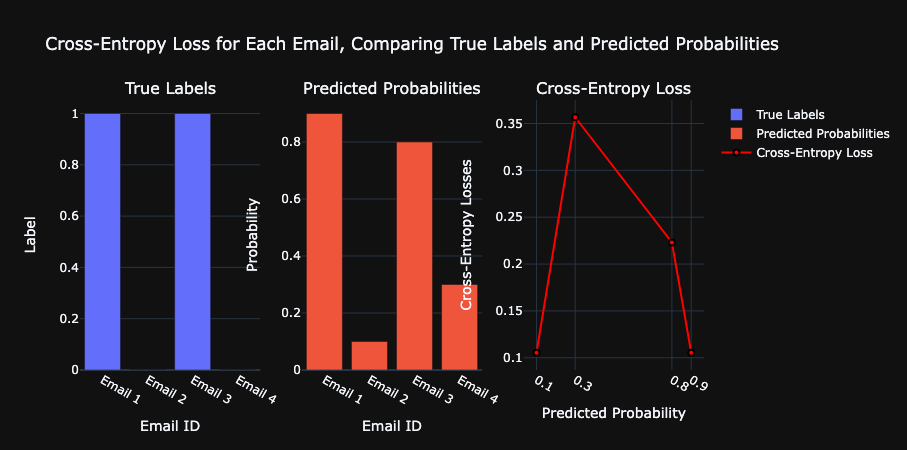

# Neural Network From Scratch


# Neural Networks

## A mathematical model of a neural network is a collection of neurons that are connected in layers

### A neural network is a collection of neurons that are connected in layers.
- A neural network has an input layer, hidden layers, and an output layer.
- The input layer is the first layer of the neural network.
    - The input layer has neurons that take the input to the neural network.
    - **Note**: The input to the neural network is the data that the network is trained on. \
    Not the data that the network is predicting. The input sits at the beginning of the neurons \
    dendrites and aggregates the input signals via dot product to the nucleus to which we \
    apply an activation function, add the bias and pass the output to the axon terminals of \
    other neurons.
- The hidden layers are the layers between the input and output layers.
- The output layer is the last layer of the neural network.
    - The output layer has neurons that produce the output of the neural network.
    - The output of the neural network is the prediction of the network.

---

### A neural network’s forward pass:
- The forward pass is the process of calculating the output of a neural network given an input.
- The output of the neural network is calculated using the weights and biases of the neurons in the network.
- The output of the neural network is the prediction of the network.
- The prediction of the network is the output of the last layer of neurons.

---

$$
\begin{equation}
L = -\sum_{l=1}^{N} y_l \log \left( \frac{\exp\left(\sum_{i=1}^{n_2}\left(\forall_{j=1}^{n_2} \max\left(0,\sum_{i=1}^{n_1}\left(\forall_{j=1}^{n_1} \max\left(0,\sum_{i=1}^{n_0} X_i w_{1,i,j} + b_{1,j}\right)\right)w_{2,i,j} + b_{2,j}\right)\right)w_{3,i,j} + b_{3,j}\right)}{\sum_{k=1}^{n_3} \exp\left(\sum_{i=1}^{n_2}\left(\forall_{j=1}^{n_2} \max\left(0,\sum_{i=1}^{n_1}\left(\forall_{j=1}^{n_1} \max\left(0,\sum_{i=1}^{n_0} X_i w_{1,i,j} + b_{1,j}\right)\right)w_{2,i,j} + b_{2,k}\right)\right)w_{3,i,k} + b_{3,k}\right)}\right)
\end{equation}
$$

#### Where:
- $L$ is the loss function
- $N$ is the number of samples
- $y$ is the true value
- $X$ is the input matrix
- $w$ is the weight matrix
- $b$ is the bias matrix
- $y$ is the true value matrix
- $n$ is the number of neurons in the layer
- $\exp$ is the exponential function
- $\log$ is the natural logarithm
- $\max$ is the maximum function that returns the maximum of two values
- $\sum$ is the sum function that returns the sum of the values in a matrix
- $\forall$ is the for all function that applies a function to all the values in a matrix
- $i$ is the index of the input
- $j$ is the index of the neuron in the hidden layer
- $k$ is the index of the neuron in the output layer
- $w_{1,i,j}$ is the weight of the connection between the input and the hidden layer
- $w_{2,i,j}$ is the weight of the connection between the hidden layer and the output layer
- $w_{3,i,j}$ is the weight of the connection between the output layer and the prediction
- $b_{1,j}$ is the bias of the neuron in the hidden layer
- $b_{2,j}$ is the bias of the neuron in the output layer
- $b_{3,j}$ is the bias of the prediction
- $n_0$ is the number of inputs
- $n_1$ is the number of neurons in the hidden layer
- $n_2$ is the number of neurons in the output layer
- $n_3$ is the number of classes

---

## Layer of Neurons

### A layer of neurons is a collection of neurons that take the same number of inputs and produce the same number of outputs.

#### The output of each neuron is calculated as follows:

---

$$
\begin{align*}
\text{Predictions} & = \text{Activation Function}(\text{weights} \cdot \text{inputs} + \text{Bias}) \\
\text{Weighted Sum of Inputs w/ Bias} & = \sigma(\sum_{i=1}^{n} w_i \cdot x_i + b) \\
\text{Weighted Sum of Inputs w/ Bias} & = \sigma(w_1 \cdot x_1 + w_2 \cdot x_2 + . . . + w_n \cdot x_n + b)
\end{align*}
$$

---

#### The Predictions are the output of the layer of neurons.
- The weights are the weights of the neurons in the layer.
- The inputs are the inputs to the layer.
- The bias is the bias of the neurons in the layer.
- The activation function is the activation function of the neurons in the layer.
- The weighted sum of inputs w/ bias is the weighted sum of the inputs to the layer plus the bias.
- The weighted sum of inputs w/ bias is the dot product of the weights and inputs plus the bias.

#### The output of each neuron is calculated as follows:
- The weighted sum of inputs and bias is calculated.
- The activation function is applied to the weighted sum of inputs and bias.
- The result is the prediction of the neuron.
- The predictions of all the neurons in the layer are returned as a list.
- The output of the layer of neurons is the list of predictions.

The output of the layer of neurons is a list of predictions, one for each 
neuron in the layer.

---

### Using Dot Product

#### Calculate the weighted sum of inputs and add the bias:


$$
\begin{align*}
\text{Weighted Sum w/ Bias} & = \sum_{i=1}^{n} w_i \cdot x_i + b \\
\text{Weighted Sum w/ Bias} & = w_1 \cdot x_1 + w_2 \cdot x_2 + . . . + w_n \cdot x_n + b
\end{align*}
$$

---

#### Example code for calculating the output of a layer of neurons:

```python
from activations import Sigmoid as ActivationFunction
# inputs to the layer of neurons
inputs = [1.0, 2.0, 3.0, 2.5]
weights = [0.2, 0.8, -0.5, 1.0]
bias = 2.0

# calculate the weighted sum of inputs and add the bias for each neuron
output = [
# Neuron 1: 
inputs[0]*weights[0] + inputs[1]*weights[1] + inputs[2]*weights[2] + inputs[3]*weights[3] + bias,
]

predictions = ActivationFunction(output)
```

---

### Using Dot Product and Bias in more detail

#### Calculate the weighted sum of inputs and add the bias:

$$
\begin{align*}
z &= w \cdot x + b \\
a &= \sigma(z)
\end{align*}
$$

Where:
- $z$ is the output of the linear function
- $w$ is the weight
- $x$ is the input
- $b$ is the bias
- $a$ is the output of the activation function
- $\sigma$ is the activation function
- $\cdot$ is the dot product
- $w \cdot x + b$ is the weighted sum of inputs and bias
- $a$ is the prediction
- $y$ is the true value
- $L$ is the loss function
- $J$ is the cost function
- $\eta$ is the learning rate
- $\nabla$ is the gradient
- $\partial$ is the partial derivative
- $N$ is the number of samples
- $m$ is the number of features
- $h$ is the number of neurons in the hidden layer
- $K$ is the number of classes
- $X$ is the input matrix
- $W$ is the weight matrix
- $B$ is the bias matrix
- $Z$ is the output of the linear function
- $A$ is the output of the activation function
- $Y$ is the true value matrix

---

## The Cross-Entropy Loss Function:

In deep learning and machine learning, the cross-entropy loss 
is a loss function used to measure the difference between two 
probability distributions `H(P, Q)`. The cross-entropy loss 
is commonly used in classification problems to measure the 
difference between the predicted probabilities and the true labels. 
It measures the variance between the two distributions namely `P` and `Q`.

The cross-entropy loss is defined as follows:

$$
\begin{equation}
L = H(P, Q) = \mathbb{E}_{z \sim P(z)}\left[\log Q(z)\right] = \int_{i}^{N} P(z) \log Q(z) \, dz.
\end{equation}
$$

Where:
- ( L ) is the cross-entropy loss
- ( H ) is the cross-entropy function
- ( P ) is the true probability distribution
- ( Q ) is the predicted probability distribution
- ( z ) is the random variable
- ( 𝔼 ) is the expected value
- $\log$ is the natural logarithm
- ( ∫ ) is the integration function over the interval (i, N)
- ( i ) is the initial value
- ( N ) is the final value 
- ( dz ) is the differential of the random variable
- ( P(z) ) is the true probability distribution
- ( Q(z) ) is the predicted probability distribution

### Mathematical Description of the Cross-Entropy Equation

The cross-entropy loss function can be described mathematically as follows:

$$
\begin{equation*}
L = H(P, Q) = -\sum_{i=1}^{N} \left( P_i \log Q_i + (1 - P_i) \log (1 - Q_i) \right)
\end{equation*}
$$

Where:
- \( $L$ \) is the cross-entropy loss.
- \( $H(P, Q)$ \) is the cross-entropy function.
- \( $P_i$ \) represents the true label for the i-th data point `(1 for the positive class, 0 for the negative class)`.
- \( $Q_i$ \) represents the predicted probability that the i-th data point belongs to the positive class `(between 0 and 1)`.
- \( $N$ \) is the total number of data points.
- The logarithm `($log$)` is typically the natural logarithm `(base \($e$\))`.

### Layman's Description of Cross-Entropy Loss

The cross-entropy loss measures how well our model's predictions match the actual labels `(AKA "truth" or "ground truth" )` for a set of data. Here's a simplified way to describe it:

1. **Prediction vs. Reality**: Imagine you have a model that predicts the likelihood of something happening, like whether an email is spam or not. The model gives you a probability for each email being spam.

2. **True Labels**: In reality, each email is either spam `(label 1)` or not spam `(label 0)`. These are the true labels.

3. **Comparison**: The cross-entropy loss compares the model's predicted probabilities to the true labels. It checks:
   - How close the predicted probability for spam is to `1`, if the email is actually spam.
   - How close the predicted probability for not spam is to `1`, if the email is not spam.

4. **Penalizing Bad Predictions**: If the model predicts a probability far from the true label (e.g., predicting 0.2 for an email that is actually spam), the loss is higher. This penalizes the model for being wrong.

5. **Summing It Up**: The cross-entropy loss adds up all these differences (errors) for every email (or data point) in the dataset. The goal is to minimize this loss, meaning you want the model to make predictions that are as close to the true labels as possible.

### Real-World Analogy: Cross-Entropy Loss in a Binary Classification Problem For Email Spam Detection

Let's consider a binary classification problem where we want to classify whether 
an email is spam or not. We have a model that predicts the probability that an 
email is spam. The true label \( $P$ \) for each email is either 1 (spam) or 0 (not spam), 
and the predicted probability \( $Q$ \) is the model's output.

Suppose we have the following true labels and predicted probabilities:

| Email ID | True Label ( $P$ ) | Predicted Probability ( $Q$ )  |
|----------|------------------|--------------------------------|
| 1        | 1                | 0.9                            |
| 2        | 0                | 0.1                            |
| 3        | 1                | 0.8                            |
| 4        | 0                | 0.3                            |

$$
\begin{align*}
\text{The cross-entropy loss for each email is calculated as:} \\
L &= H(P, Q) = -\sum_{i=1}^{N} \left( P_i \log Q_i + (1 - P_i) \log (1 - Q_i) \right)
\end{align*}
$$

$$
\begin{align*}
\text{For each email, the loss is calculated as:} \\
L_1 &= -\left( 1 \times \log 0.9 ) + (1 - 1) \times \log (1 - 0.9) \right) = 0.1054 \\
L_2 &= -\left( 0 \times \log 0.1 ) + (1 - 0) \times \log (1 - 0.1) \right) = 0.1054 \\
L_3 &= -\left( 1 \times \log 0.8 ) + (1 - 1) \times \log (1 - 0.8) \right) = 0.2231 \\
L_4 &= -\left( 0 \times \log 0.3 ) + (1 - 0) \times \log (1 - 0.3) \right) = 0.3567 \\
\\
\text{Calculate the average loss:} \\
L &= \frac{1}{4} \times (0.1054 + 0.1054 + 0.2231 + 0.3567) \\
L &= 0.19765
\end{align*}
$$

The average cross-entropy loss for these emails is 0.19765. This means that \
the model's predictions are not very accurate. The goal is to minimize this \
loss by adjusting the model's parameters during training.

#### Graphing the Cross-Entropy Loss Function



### Key Points:
- The cross-entropy loss measures the difference between the true labels and predicted probabilities.
- Lower cross-entropy loss indicates better model predictions.
- The goal is to minimize the cross-entropy loss during model training.
- The cross-entropy loss is commonly used in classification problems.
- The loss function penalizes the model for incorrect predictions.
- The loss is calculated as the average of the losses for each sample in the dataset.
- The loss is typically minimized using optimization algorithms like gradient descent.
- The cross-entropy loss is a fundamental concept in deep learning and machine learning.
- The loss function plays a crucial role in training neural networks and evaluating model performance.
- The loss function guides the learning process by providing feedback on the model's predictions.
- The cross-entropy loss is widely used in various applications, including image classification, natural language processing, and more.
- Understanding the cross-entropy loss is essential for building and training machine learning models.
- The loss function helps quantify the model's performance and provides insights into its predictive accuracy.
- The cross-entropy loss is a key component of the training process in supervised learning tasks.

---

#### The cost function is the mean loss:

$$
J = \frac{1}{N} \sum_{i=1}^{N} L
$$
    
Where:
- ( $J$ ) is the cost function or the mean loss
- $N$ is the number of samples
- $L$ is the loss function or the cross-entropy loss
- $i$ is the index of the sample
- $\sum$ is the sum function that returns the sum of the values in a matrix

---

#### The gradient of the weight is:

$$
\begin{align*}
\frac{\partial J}{\partial W} &= \frac{1}{N} X^T \cdot \nabla_{A} J
\end{align*}
$$

---

#### The gradient of the bias is:

$$
\begin{align*}
\frac{\partial J}{\partial B} &= \frac{1}{N} \sum_{i=1}^{N} \nabla_{A} J
\end{align*}
$$

---

#### The gradient of the input is:

$$
\begin{align*}
\frac{\partial J}{\partial X} &= \nabla_{A} J \cdot W^T
\end{align*}
$$

---

#### The gradient of the output is:

$$
\begin{align*}
\nabla_{A} J &= - \frac{1}{N} \frac{Y}{A}
\end{align*}
$$

---

#### The gradient of the activation function is:

$$
\begin{align*}
\nabla_{Z} J &= \nabla_{A} J \cdot \sigma(Z) \cdot (1 - \sigma(Z))
\end{align*}
$$

---

#### The gradient of the weight is:

$$
\begin{align*}
\frac{\partial J}{\partial W} &= \frac{1}{N} X^T \cdot \nabla_{Z} J
\end{align*}
$$

---

## References

---

- [Neural Newtorks from Scratch](https://nnfs.io/)
- Kinsley, H., & Kukieła, D. (2020). Neural Networks from scratch in Python. Harrison Kinsley. 
- Russell, S. J., Norvig, P., Chang, M.-W., Devlin, J., Dragan, A., Forsyth, D., Goodfellow, I., 
Malik, J. M., Mansinghka, V., Pearl, J., & Wooldridge, M. (2022). Artificial Intelligence: A 
modern approach, fourth edition Stuart J. Russell and Peter Norvin; contribuiting writers, 
Ming-Wei Chang ... et al.. (4th ed.). Pearson Education. 