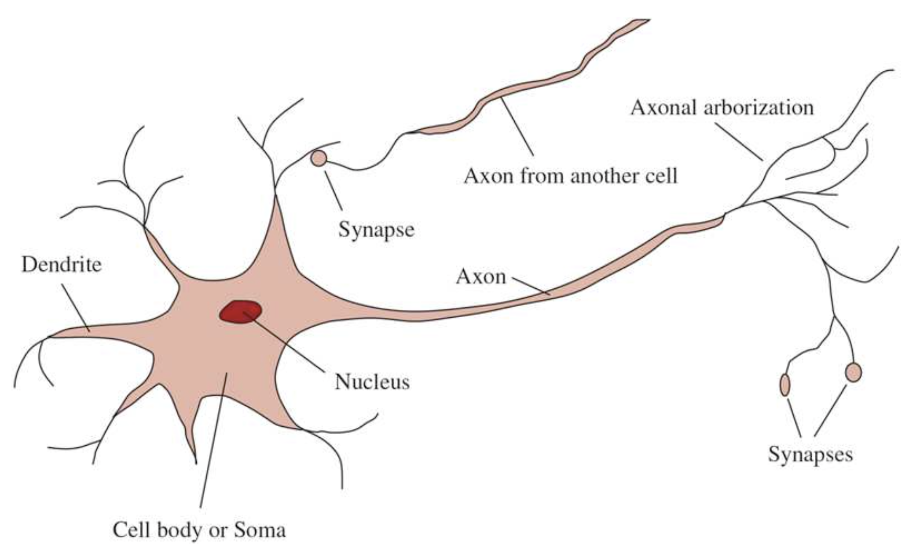
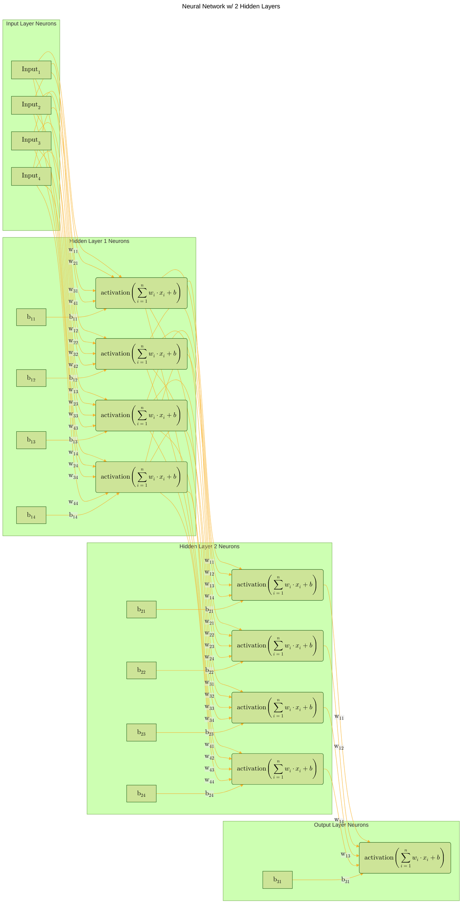

# Neural Network From Scratch

---

### Table of Contents

- [Introduction](#introduction)
  - [Neuroscience](#neuroscience)
- [A Neural Network](#a-neural-network)
- [A Neural Network’s forward pass](#a-neural-networks-forward-pass)
- [Loss Functions](./notebooks/LossFunctions.ipynb#cross-entropy-loss-function)
- Activation Functions:
  - [Softmax](./notebooks/Activations.ipynb#softmax)

---

## Introduction

### Neuroscience

`Neuroscience` focuses on studying the nervous system, especially the brain. 
The link between brain function and thought has been recognized for thousands 
of years, evidenced by the fact that head injuries can cause mental impairment. 
Aristotle noted around 335 BCE that humans have proportionally larger brains 
than other animals, hinting at the brain's unique role in thought. However, 
it wasn't until the mid-18th century that the brain was widely accepted as 
the center of consciousness—previously, other organs like the heart were considered.

In 1861, Paul Broca's work on patients with speech deficits (aphasia) led to 
the discovery of a specific brain area in the left hemisphere, now known as 
Broca's area, crucial for speech production. By that time, it was understood 
that the brain was made up of nerve cells, or neurons. In 1873, Camillo Golgi 
developed a staining method that allowed the visualization of individual neurons, 
a technique later used by Santiago Ramon y Cajal in his studies of neuronal organization.

Today, it is widely accepted that `cognitive functions arise from the electrochemical 
activities of neurons or networks of neurons`. In the words of philosopher John Searle, "brains cause minds," 
emphasizing that simple cells in the brain can lead to complex thoughts, actions, and 
consciousness.

---


Figure 1: A neuron is a specialized cell that processes and transmits information through 
electrochemical signals. <sup>[[3]](#references)</sup>

---

#### Parts of a Neuron

- **Cell Body (Soma)**: 
  - Contains the nucleus, which holds the genetic material of the neuron.
  - Acts as the main processing center of the neuron.

- **Dendrites**:
  - Branch-like fibers extending from the cell body.
  - Receive signals from other neurons and transmit them to the cell body.

- **Axon**:
  - A single, long fiber extending from the cell body.
  - Can be up to 1 meter long, significantly longer than the cell body.
  - Transmits electrical signals away from the cell body to other neurons or muscles.

- **Synapses**:
  - Junctions where the axon of one neuron connects to the dendrite of another neuron.
  - Sites of electrochemical signal transmission between neurons.
  - Each neuron can form connections with 10 to 100,000 other neurons.

- **Electrochemical Signaling**:
  - Neurons communicate via complex electrochemical reactions.
  - These signals control short-term brain activity and enable long-term changes in neuron connectivity, which are crucial for learning.

- **Cerebral Cortex**:
  - The outer layer of the brain, where most information processing occurs.
  - Organized into columns of tissue about 0.5 mm in diameter, each containing approximately 20,000 neurons and extending the full depth of the cortex (around 4 mm in humans).

- **Brain-Body Mapping**:
  - Certain brain areas map to specific body parts for control and sensory input.
  - These mappings can change over time, and some animals have multiple mappings.
  - Other brain areas may take over functions if one area is damaged.

- **Memory and Cognitive Functions**:
  - Current understanding of how individual memories are stored and how higher-level cognitive functions operate is limited.

---

#### Linking Biological Neurons to Artificial Neurons in Machine Learning

- **Cell Body (Soma) → Node/Neuron in a Neural Network**:
  - **Biological Neuron**: The cell body processes incoming signals and determines whether to pass the signal on.
  - **Artificial Neuron**: A node in a neural network receives inputs, processes them using an activation function, and determines the output.

- **Dendrites → Input Connections**:
  - **Biological Neuron**: Dendrites receive signals from other neurons and transmit them to the cell body.
  - **Artificial Neuron**: Input connections (or weights) receive data from other nodes or input features in the network.

- **Axon → Output Signal**:
  - **Biological Neuron**: The axon transmits the electrical signal from the cell body to other neurons.
  - **Artificial Neuron**: The output of the node is passed on to other nodes in the network or to the final output layer.

- **Synapses → Weights and Biases**:
  - **Biological Neuron**: Synapses are junctions where signals are transmitted from one neuron to another, influencing the strength of the signal.
  - **Artificial Neuron**: Weights determine the strength and influence of the input signals, while biases adjust the output independently of the input.

- **Electrochemical Signaling → Activation Function**:
  - **Biological Neuron**: Neurons communicate via electrochemical signals, which trigger responses in connected neurons.
  - **Artificial Neuron**: The activation function determines the output signal of a neuron, based on the weighted sum of its inputs.

- **Cerebral Cortex → Neural Network Architecture**:
  - **Biological Neuron**: The cerebral cortex is where complex processing occurs, organized into columns with interconnected neurons.
  - **Artificial Neuron**: Neural networks have architectures where layers of interconnected nodes process complex patterns in the data.

- **Brain-Body Mapping → Feature Mapping and Output Layers**:
  - **Biological Neuron**: Certain brain areas correspond to specific body parts and sensory inputs, and can adapt over time.
  - **Artificial Neuron**: In machine learning models, certain neurons and layers correspond to specific features and outputs, and models can adapt through training.

- **Memory and Cognitive Functions → Learning and Generalization**:
  - **Biological Neuron**: Neurons enable learning through changes in connectivity and memory formation, though the mechanisms are not fully understood.
  - **Artificial Neuron**: Neural networks learn by adjusting weights and biases through backpropagation, improving their ability to generalize from training data to unseen data.

---

## A Neural Network

###  A neural network is a collection of neurons that are connected in layers.
- A neural network has an `input layer`, `hidden layers`, and an `output layer`.
- Each neuron in a neural network is a called a `node`, but by convention, 
we refer to nodes as `units`. A `unit` is a `node (neuron)` in a neural network that 
takes an input, calculates the weighted sum of the inputs from predecessor 
nodes and then applies a nonlinear function to produce its output.
- The input layer is the first layer of the neural network.
    - The input layer has neurons that take the input to the neural network.
    - **Note**: The input to the neural network is the data that the network is trained on. \
    Not the data that the network is predicting. The input sits at the beginning of the neurons \
    dendrites and aggregates the input signals via dot product to the nucleus to which we \
    apply an activation function, add the bias and pass the output to the axon terminals of \
    other neurons.
- The hidden layers are the layers between the input and output layers.
- The output layer is the last layer of the neural network.
    - The output layer has neurons that produce the output of the neural network.
    - The output of the neural network is the prediction of the network.

---

### A neural network’s forward pass:

- The forward pass is the process of calculating the output of a neural network given an input.
- The output of the neural network is calculated using the weights and biases of the neurons in the network.
- The output of the neural network is the prediction of the network.
- The prediction of the network is the output of the last layer of neurons.

#### Equation of Forward Pass <sup>[[2]](#references)</sup>:

$$
\begin{align*}
L = - \sum_{l=1}^{N} y_l \log \left( \forall_{j=1}^{n_3} \left[ \frac{e^{\sum_{i=1}^{n_2} \max \left(0, \sum_{i=1}^{n_1} \max \left(0, \sum_{i=1}^{n_0} X_i w_{1,i,j} + b_{1,j} \right) w_{2,i,j} + b_{2,j} \right) w_{3,i,j} + b_{3,j}}}
{\sum_{k=1}^{n_3} e^{\sum_{i=1}^{n_2} \max \left(0, \sum_{i=1}^{n_1} \max \left(0, \sum_{i=1}^{n_0} X_i w_{1,i,k} + b_{1,k} \right) w_{2,i,k} + b_{2,k} \right) w_{3,i,k} + b_{3,k}}} \right] \right)
\end{align*}
$$

#### Where:
- $L$ is the loss function
- $N$ is the number of samples
- $y$ is the true value
- $X$ is the input matrix
- $w$ is the weight matrix
- $b$ is the bias matrix
- $y$ is the true value matrix
- $n$ is the number of neurons in the layer
- $\exp$ is the exponential function
- $\log$ is the natural logarithm
- $\max$ is the maximum function that returns the maximum of two values
- $\sum$ is the sum function that returns the sum of the values in a matrix
- $\forall_{j=1}^{n_3}$ For every index $j$ in the range from 1 to $n_3$, the following 
operation or condition holds.
- $i$ is the index of the input
- $j$ is the index of the neuron in the hidden layer
- $k$ is the index of the neuron in the output layer
- $w_{1,i,j}$ is the weight of the connection between the input and the hidden layer
- $w_{2,i,j}$ is the weight of the connection between the hidden layer and the output layer
- $w_{3,i,j}$ is the weight of the connection between the output layer and the prediction
- $w_{3,i,k}$ is the weight of the connection between the output layer and the prediction
- $b_{1,j}$ is the bias of the neuron in the hidden layer
- $b_{2,j}$ is the bias of the neuron in the output layer
- $b_{3,j}$ is the bias of the prediction
- $b_{3,k}$ is the bias of the prediction
- $n_0$ is the number of inputs
- $n_1$ is the number of neurons in the hidden layer
- $n_2$ is the number of neurons in the output layer
- $n_3$ is the number of classes

---

## Layer of Neurons

A `layer of neuron(s)` is a collection of neurons that take the same number of inputs and produce the same number of outputs.

#### The output of each neuron is calculated as follows:

---

$$
\begin{align*}
\text{Weighted Sum of Inputs + Bias} & = \sigma \left(\sum_{i=1}^{n} w_i \cdot x_i + b \right) \\
\text{Weighted Sum of Inputs + Bias} & = \sigma \left(w_1 \cdot x_1 + w_2 \cdot x_2 + . . . + w_n \cdot x_n + b \right) \\
\text{Predictions} & = \text{Activation Function} \left(\text{weights} \cdot \text{inputs} + \text{Bias} \right) \\
\text{Predictions} & = \text{Activation Function} \left(\text{dot product of weights and inputs} + \text{Bias} \right)
\end{align*}
$$

---

#### The Predictions are the output of the layer of neurons.
- The weights are the weights of the neurons in the layer.
- The inputs are the inputs to the layer.
- The bias is the bias of the neurons in the layer.
- The activation function is the activation function of the neurons in the layer.
- The weighted sum of inputs w/ bias is the weighted sum of the inputs to the layer plus the bias.
- The weighted sum of inputs w/ bias is the dot product of the weights and inputs plus the bias.

#### The output of each neuron is calculated as follows:
- The weighted sum of inputs and bias is calculated.
- The activation function is applied to the weighted sum of inputs and bias.
- The result is the prediction of the neuron.
- The predictions of all the neurons in the layer are returned as a list.
- The output of the layer of neurons is the list of predictions.

The output of the layer of neurons is a list of predictions, one for each 
neuron in the layer.

---

### Using Dot Product

#### Calculate the weighted sum of inputs and add the bias:


$$
\begin{align*}
\text{Weighted Sum w/ Bias} &= \sum_{i=1}^{n} w_i \cdot x_i + b \\
\text{Weighted Sum w/ Bias} &= w_1 \cdot x_1 + w_2 \cdot x_2 + . . . + w_n \cdot x_n + b
\end{align*}
$$

---

### Using Dot Product and Bias in more detail

#### Calculate the weighted sum of inputs and add the bias:

$$
\begin{align*}
z &= w \cdot x + b \\
a &= \sigma(z)
\end{align*}
$$

Where:
- $z$ is the output of the linear function
- $w$ is the weight
- $x$ is the input
- $b$ is the bias
- $a$ is the output of the activation function or prediction
- $\sigma$ is the activation function
- $\cdot$ is the dot product
- $w \cdot x + b$ is the weighted sum of inputs and bias


---

#### Example NN with Two hidden layer of neurons.




#### Explanation:
- The input layer has 4 inputs.
- Two hidden layers of 4 neurons with 4 inputs each.
- The neuron takes the inputs, calculates the weighted sum of the inputs and bias $\left[\sum_{i=1}^{n} w_i \cdot x_i + b\right]$, 
applies the activation function, and produces the output. 
- The output of the hidden layer is the prediction of the neuron.
- The output of the hidden layer is the output of the layer(s) of neurons.


---

#### Example code for calculating the output of a layer of neurons:

```python
from src.functions.activation import Sigmoid

# Initialize the activation function
sigmoid = Sigmoid()

# inputs to the layer of neurons
inputs = [1.0, 2.0, 3.0, 2.5]
weights = [
    [0.2, 0.8, -0.5, 1.0],
    [0.5, -0.91, 0.26, -0.5],
    [-0.26, -0.27, 0.17, 0.87],
    [1.2, -2.1, 0.2, 0.1]
]
weights2 = [
    [0.21, 0.81, -0.51, 1.01],
    [0.51, -0.91, 0.27, -0.51],
    [-0.27, -0.28, 0.18, 0.88],
    [1.21, -2.11, 0.21, 0.11]
]
bias = 2.0
bias2 = 3.0

# calculate the weighted sum of inputs and add the bias for each neuron
output = [
# Neuron 1: 
    sum([inputs[i] * weights[i][0] for i in range(len(inputs))]) + bias,
# Neuron 2:
    sum([inputs[i] * weights[i][1] for i in range(len(inputs))]) + bias,
]

predictions = sigmoid(output)
```

---

### References

---

1. [Neural Newtorks from Scratch](https://nnfs.io/) 
2. Kinsley, H., & Kukieła, D. (2020). Neural Networks from scratch in Python. Harrison Kinsley. 
3. Russell, S. J., Norvig, P., Chang, M.-W., Devlin, J., Dragan, A., Forsyth, D., Goodfellow, I., 
Malik, J. M., Mansinghka, V., Pearl, J., & Wooldridge, M. (2022). Artificial Intelligence: A 
modern approach, fourth edition Stuart J. Russell and Peter Norvin; contribuiting writers, 
Ming-Wei Chang ... et al.. (4th ed.). Pearson Education. 

